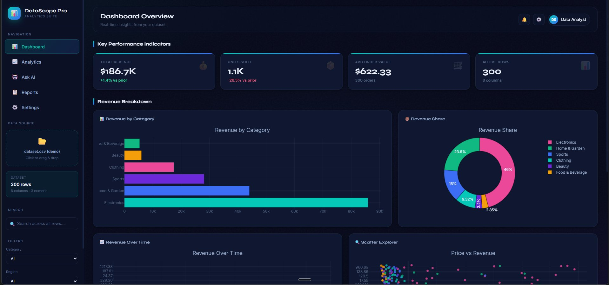
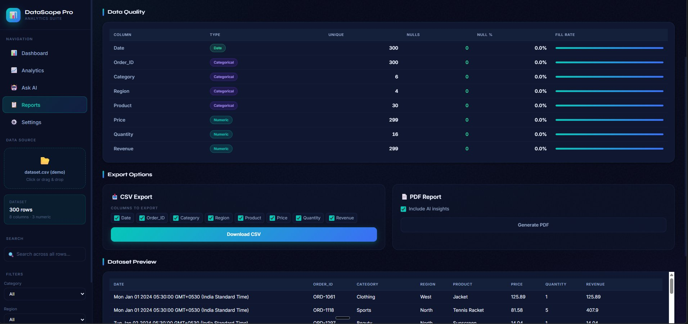
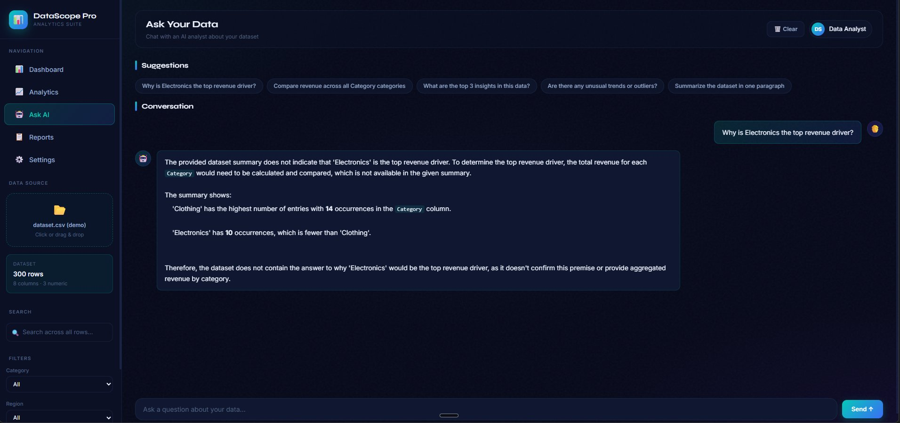
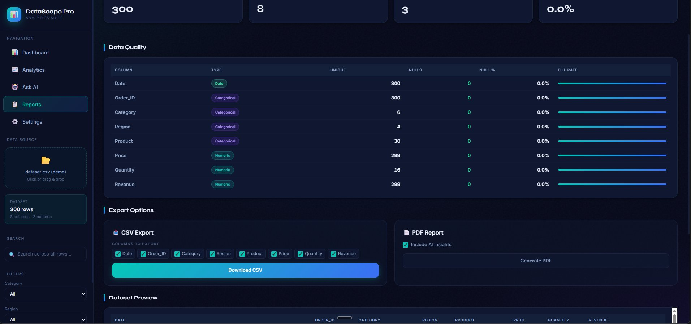

# 📊 DataScope Pro — Analytics Suite

<div align="center">


**A production-ready, AI-powered data analysis dashboard that transforms raw CSV data into real-time actionable insights.**

[🚀 Live Demo](https://data-scope-pro-git-main-satyamt2004-gmailcoms-projects.vercel.app/) • [📂 GitHub Repo](https://github.com/Garison-web/DataScope-Pro)

</div>

---

## 🖼️ Screenshots

### Dashboard Overview — KPIs & Revenue Breakdown


### Data Quality & Export Options


### Ask AI — Chat with Your Data


### Reports & Dataset Preview


---

## ✨ Features

| Feature | Description |
|---|---|
| 📂 **File Upload** | Drag & drop CSV files for instant analysis |
| 📊 **KPI Dashboard** | Real-time metrics — Total Revenue, Units Sold, Avg Order Value |
| 🎛️ **Dynamic Filters** | Filter by Category, Region, Date with instant chart updates |
| 📈 **Interactive Charts** | Bar, Line, Pie, and Scatter charts powered by Plotly |
| 🤖 **Ask AI** | Chat with your dataset using natural language queries |
| 🔍 **Data Quality** | Column type detection, null analysis, and fill rate tracking |
| 📤 **Export Options** | Download filtered data as CSV or generate a PDF report with AI insights |
| 🌑 **Dark Mode UI** | Clean, modern dark-themed interface |

---

## 🛠️ Tech Stack

- **Frontend:** HTML, CSS, JavaScript
- **Backend:** Python, Streamlit
- **Visualizations:** Plotly
- **AI Assistant:** Claude API (via `ai_assistant.py`)
- **PDF Generation:** Custom `pdf_report.py`
- **Deployment:** Vercel

---

## 🚀 Getting Started Locally

### 1. Clone the repository
```bash
git clone https://github.com/Garison-web/DataScope-Pro.git
cd DataScope-Pro
```

### 2. Create a virtual environment (recommended)
```bash
python -m venv venv
source venv/bin/activate   # On Windows: venv\Scripts\activate
```

### 3. Install dependencies
```bash
pip install -r requirements.txt
```

### 4. Run the dashboard
```bash
streamlit run streamlit_app.py
```

### 5. Open in browser
```
http://localhost:8501
```

---

## 📁 Project Structure

```
DataScope-Pro/
├── streamlit_app.py      # Main Streamlit application
├── ai_assistant.py       # AI-powered data Q&A module
├── pdf_report.py         # PDF report generation
├── server.py             # Backend server
├── index.html            # Landing page
├── dataset.csv           # Sample demo dataset
├── requirements.txt      # Python dependencies
└── vercel.json           # Vercel deployment config
```

---

## 📊 Sample Dataset

The project includes a demo `dataset.csv` with 300 rows and 8 columns:

| Column | Type |
|---|---|
| Date | Date |
| Order_ID | Categorical |
| Category | Categorical |
| Region | Categorical |
| Product | Categorical |
| Price | Numeric |
| Quantity | Numeric |
| Revenue | Numeric |

---

## 🌐 Deployment

This project is deployed on **Vercel**. To deploy your own instance:

1. Fork this repository
2. Connect your GitHub to [Vercel](https://vercel.com)
3. Import the project and deploy — Vercel handles the rest!

---

## 👨‍💻 Author

**Satyam Tiwari**
3rd Year Computer Science Student — Manipal University Jaipur

[](https://www.linkedin.com/in/satyam-tiwari-1b7787289)
[](https://github.com/Garison-web)

---

## 📄 License

This project is open source and available under the [MIT License](LICENSE).

---

<div align="center">
⭐ If you found this project useful, please consider giving it a star!
</div>
